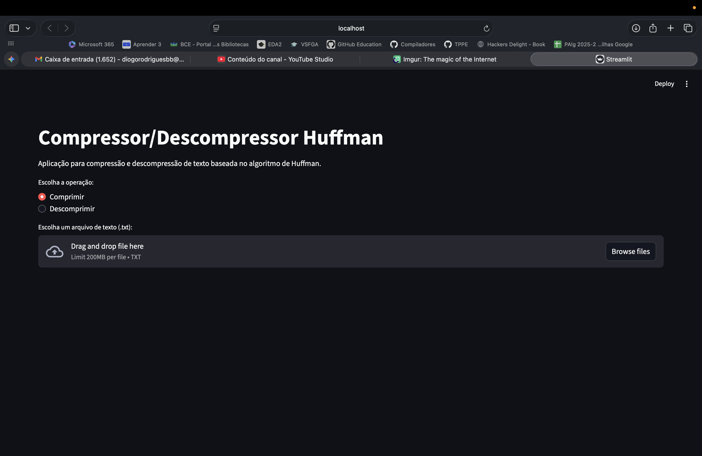
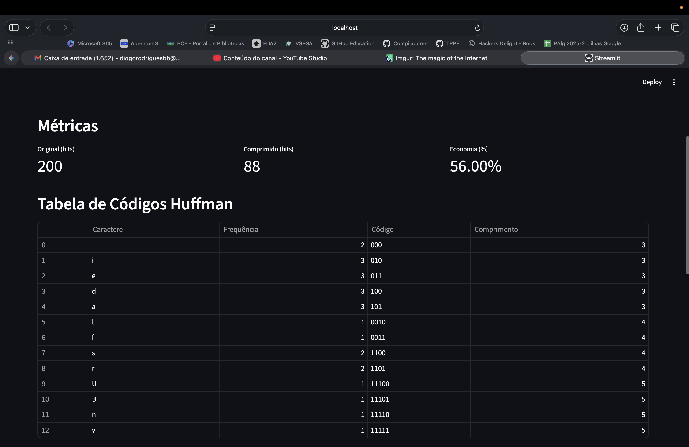
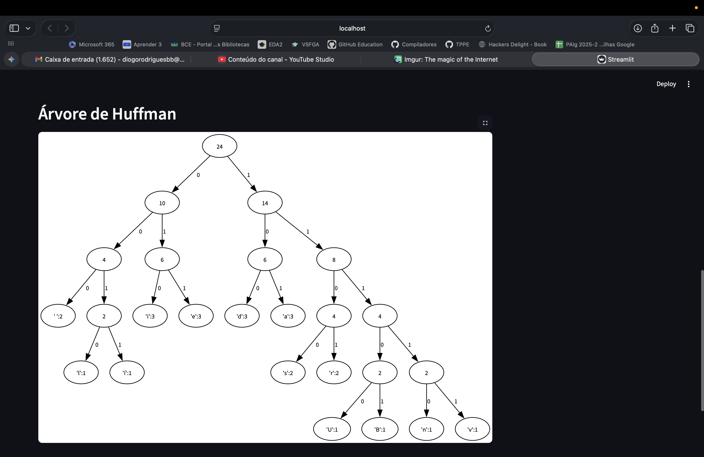
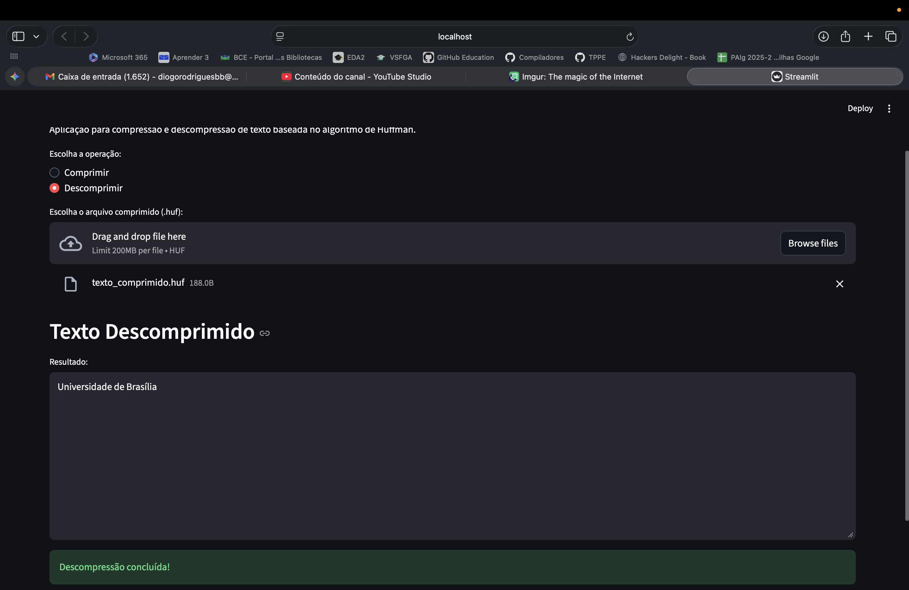

# txtCompress
Um compressor de arquivo de texto usando o código de Huffman.

**Número da Lista**: 3
**Conteúdo da Disciplina**: FGA0124 - PROJETO DE ALGORITMOS - T01  


## Alunos


<div align = "center">
<table>
  <tr>
    <td align="center"><a href="https://github.com/DanielFsR"><br /><sub><b>Daniel Ferreira</b></sub></a><br /><a href="Link git" title="Rocketseat"></a></td>
    <td align="center"><a href="https://github.com/Diogo-Barboza"><br /><sub><b>Diogo Barboza </b></sub></a><br />
  </tr>
</table>

| Matrícula   | Aluno                             |
| ----------- | ----------------------------------|
| 22/2006632  | Daniel Ferreira                   |
| 22/2006660  | Diogo Rodrigues Barboza           |
</div>

## Sobre 
Um compressor de arquivo de texto usando o código de Huffman. Podendo ser usado para criptografia, e o site mostra a árvore no fim, podendo ser usada para fins didáticos também.

## Screenshots









## Instalação e Ferramentas
- **Python 3.13**
- **Streamlit** (interface gráfica)
- **Heapq** (Criação da Heap)
- **graphviz** (visualização da árvore)


## Como compilar e executar o projeto

1. Clone este repositório  
2. Crie um ambiente virtual:
   ```bash
   python3 -m .venv venv
   source venv/bin/activate

3. Instale as dependências
    ```bash
    pip install -r requirements.txt

4. Execute o projeto:
    ```bash
    python -m streamlit run app.py


## Uso 

Pode ser facilmente usado para ensinar de forma didática e para comprimir grandes arquivos de texto.

## Apresentação 

<div align="center">
<a href="https://www.youtube.com/watch?v=2s-DOS8gRI0"></a>
</div>

[](https://www.youtube.com/watch?v=2s-DOS8gRI0)

<font size="3"><p style="text-align: center">Autor: [Diogo Barboza](https://github.com/) e [Daniel Ferreira](https://github.com/).</p></font>